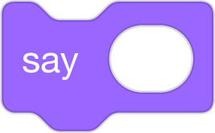
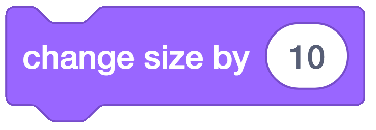

# Scaffolding Techniques
#### by Block 19
Roster: Alana Robinson, Ashley Ufret, Shana Elizabeth Henry, Qianhui Vanessa Zou

Programming Language:  Scratch

Scaffold: Storyboard, UDL

Activity: Students will learn how a pattern in a story is connected to a loop in CS. They will use block based code to describe the pattern/loop in the text Goldilocks and the Three Bears.

Big Idea/Understanding: In code we use a repeat block to create a loop.

Task: Listen to the read aloud, Goldilocks and Three Bears. Identify the loop in the story and use Scratch blocks to show the loop. 

Printable (Text Only) Version: https://www.dltk-teach.com/rhymes/pgoldilocks_story.asp

Video Version Read-Aloud: https://www.dltk-teach.com/rhymes/pgoldilocks_story.asp

UDL/Differentiation Options: Students chose which activity they want to work on with Scratch Code Blocks/Task Cards
*Student Choice: Students will get an overview of all tasks, and self-evaluate skill level to chose task (rather than teacher assigned) *Leveled Tasks: Student's will get choices for all levels of expertise from beginner to advanced. *All or select students can work in strategic pairs as driver/navigator (this can allow for all students to access more challenging tasks)

Leveled Tasks: 

a) Basic: Students are given 5-6 Scratch blocks that are required to show a loop. The blocks are out of order and they need to reorder those blocks to show a loop/repetition in the story. Note: Students would get the solution to the loop if there are errors before coding loop to reinforce concept/connection between a pattern in a story and a loop in CS, and between the function of a loop and the repeat block in coding with blocks.

b) Intermediate: Students will select several scratch blocks that will demonstrate a loop in the story. They would be given additional blocks that would be optional additions to demonstrate the loop, in addition to blocks would not be appropriate.

c) Advanced: Students would have all blocks on scratch available to choose from to plan code to demonstrate the pattern in the story using a loop. They will retell the story to determine what number they would have to show in the repeat block to have a loop that shows how many items Goldilocks tried something in the bears home (until she found the one that was just right).

Additional options to differentiate task: 
Students work in strategic pairs as driver/navigator. 

