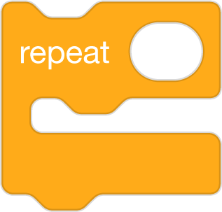
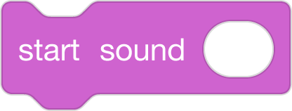

# Scaffolding Techniques
#### by Block 19
Roster: Alana Robinson, Ashley Ufret, Shana Elizabeth Henry, Qianhui Vanessa Zou

Programming Language:  Scratch

Scaffold: Storyboard

Activity: Use code to describe the pattern in the text with Loops.

Students are provided the scratch solution code blocks 

UDL/Differentiation Options: Students chose which works activity they want to work on with Scratch Code Blocks/Task Cards

a) Basic: Students are given 5-6 Scratch blocks that are out of order and they need to reorder those blocks to show a loop/repetition in the story.  Students will put the when green flag clicked on top, then put the say block inside the repeat block. They will have the say block, say the part of the text that is repeated in the text. 

b) Intermediate: Students will select several scratch blocks that will demonstrate a loop in the story. 
 Students will put the when green flag clicked on top, then put the say/start sound block inside the repeat block. They will have the say/start sound block, include the part of the text that is repeated in the text. They may have additional features such as costumes/sprites for the chair, bed with the different sizes. They would use this plan to complete the project on https://scratch.mit.edu, then run/debug as necessary.

c) Advanced: Students would be able to identify and discard blocks that would be inappropriate. Then, they would put the remaining blocks in order and explain how the program would demonstrate the loop in the story. They would have the main section: Solution: Students will put the when green flag clicked on top, then put the say/start sound block inside the repeat block. The solution would include the repeat loop with the number of repitions == to the number of times Goldilocks repeats the loop of this one is "too big, this one is too small, this one is juuust right!" This can vary depending on the version of the story used, but for the example text provided in the lesson resources it would be Repeat 3 (porridge, chair, bed). They will have the say/start sound block, include the part of the text that is repeated in the text. They may have additional features such as costumes/sprites for the chair, bed with the different sizes.