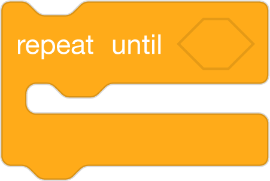

# Scaffolding Techniques
#### by Block 19
Roster: Alana Robinson, Ashley Ufret, Shana Elizabeth Henry, Qianhui Vanessa Zou

Programming Language:  Scratch

Scaffold: Storyboard

Activity: Use code to describe the pattern in the text with Loops.

Students are provided the scratch solution code blocks 

UDL/Differentiation Options: Students chose which works activity they want to work on with Scratch Code Blocks/Task Cards

a) Students are given 5-6 Scratch blocks that are out of order and they need to reorder those blocks to show a loop/repetition in the story.(Basic)

b) Students will select several scratch blocks that will demonstrate a loop in the story (Intermediate)

